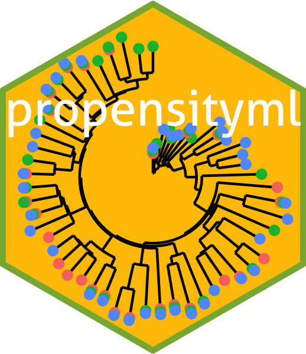

```{r setup, include=FALSE}
knitr::opts_chunk$set(
  comment = "#>",
  collapse = TRUE,
  out.width = "70%",
  fig.align = "center",
  fig.width = 6,
  fig.asp = .618,
  fig.pos = "H"
  )
knitr::knit_hooks$set(
  document = function(x) {
    sub("\\usepackage[]{color}", "\\usepackage{xcolor}", x, fixed = TRUE)
  }
)
options(digits = 3)
options(kableExtra.latex.load_packages = FALSE)
is_latex <- knitr::opts_knit$get("rmarkdown.pandoc.to") == "latex"
is_beamer <- knitr::opts_knit$get("rmarkdown.pandoc.to") == "beamer"
```

```{r, message=FALSE, echo=FALSE}
# tidyverse family---------------------
library(dplyr)
# large data frame---------------------
library(data.table)
# parallel-----------------------------
library(foreach)
# set seed for report -----------------
set.seed(1)
```

# Introduction

## Reviewed Paper

<!-- ```{r, include=FALSE} -->
<!-- Citet(bib, "cmm") -->
<!-- ``` -->

<!-- ```{r, message=FALSE, echo=FALSE, comment=NULL, results='asis'} -->
<!-- PrintBibliography(bib) -->
<!-- ``` -->

Reviewd and apply @cmm: estimate propensity score using

- Logistic regression
- Random forests
- CART
- SVM

## Custom Package

```{r, message=FALSE}
# remotes::install_github("ygeunkim/propensityml")
library(propensityml)
```

```{r, echo=FALSE, out.width="30%"}

```

## Simulation study

Simulation setting by @utg:

- 10 covariates: confounders, exposure predictors, outcome predictors
- Treatment
- Outcome probability

```{r, echo=FALSE, out.width="65%"}
knitr::include_graphics("../docs/lee_fig1.jpeg")
```

## Scenarios

1. Additivity and linearity
2. Mild non-linearity: *1 quadratic term*
3. Moderate non-linearity: *3 quadratic term*
4. Mild non-additivity: *3 two-way interaction terms*
5. Mild non-additivity and non-linearity: *3 two-way interaction terms and 1 quadratic term*
6. Moderate non-linearity: *10 two-way interaction terms*
7. Moderate non-additivity and non-linearity: *10 two-way interaction terms and 3 quadratic terms*

## Function to reproduce @utg

\footnotesize
```{r}
sim_outcome(n = 1000, covmat = build_covariate()) %>% str()
```

\normalsize

# Propensity Score Estimation

## Sample Size

For simulation, 1000 replicates

### Small: 500

with 7 scenarios

```{r, echo=FALSE, cache=TRUE}
doMC::registerDoMC(cores = 4)
small_list <- foreach(scenario = LETTERS[1:7], .combine = rbind) %dopar% {
  mc_setoguchi(N = 1000, n_dat = 500, scenario = scenario, parallel = TRUE)[,
                                                                            scenario := scenario]
}
```

### Medium: 1000

with 7 scenarios

```{r, echo=FALSE, cache=TRUE}
doMC::registerDoMC(cores = 4)
medium_list <- foreach(scenario = LETTERS[1:7], .combine = rbind) %dopar% {
  mc_setoguchi(N = 1000, n_dat = 1000, scenario = scenario, parallel = TRUE)[,
                                                                             scenario := scenario]
}
```

### Large: 2000

with 7 scenarios

```{r, echo=FALSE, cache=TRUE}
doMC::registerDoMC(cores = 4)
large_list <- foreach(scenario = LETTERS[1:7], .combine = rbind) %dopar% {
  mc_setoguchi(N = 1000, n_dat = 2000, scenario = scenario, parallel = TRUE)[,
                                                                             scenario := scenario]
}
```

## Covariate Balance

For example,

\scriptsize
```{r}
compute_balance(
  small_list[mcname == 1 & scenario == "A", -c("mcname", "scenario")],
  treatment = "exposure", trt_indicator = 1, outcome = "outcome_prob"
)
```

\normalsize
Average(`balance`) = **Average standardized absolute mean distance** (ASAM).

## Average standardized absolute mean distance (ASAM)

- Evaluation
- After applying weighting

## Logistic Regression


# Evaluation


# Related Contents

## About this project

### Project repository

[https://github.com/ygeunkim/psweighting-ml](https://github.com/ygeunkim/psweighting-ml)

### Project package

[https://github.com/ygeunkim/propensityml](https://github.com/ygeunkim/propensityml)

# References


