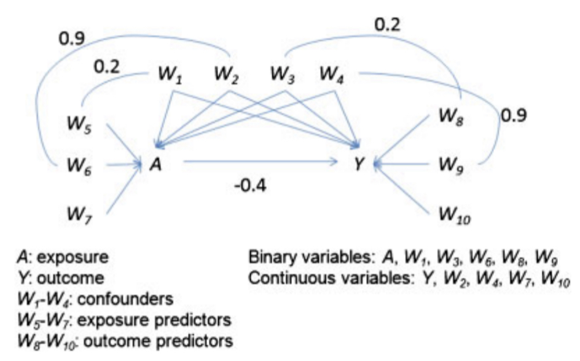

```{r setup, include=FALSE}
knitr::opts_chunk$set(
  comment = "#>",
  collapse = TRUE,
  out.width = "70%",
  fig.align = "center",
  fig.width = 6,
  fig.asp = .618,
  fig.pos = "H"
  )
knitr::knit_hooks$set(
  document = function(x) {
    sub("\\usepackage[]{color}", "\\usepackage{xcolor}", x, fixed = TRUE)
  }
)
options(digits = 3)
options(kableExtra.latex.load_packages = FALSE)
is_latex <- knitr::opts_knit$get("rmarkdown.pandoc.to") == "latex"
is_beamer <- knitr::opts_knit$get("rmarkdown.pandoc.to") == "beamer"
```

```{r, message=FALSE, echo=FALSE}
# tidyverse family---------------------
library(tidyverse)
# large data frame---------------------
library(data.table)
# parallel-----------------------------
library(foreach)
library(parallel)
# custom packages----------------------
library(rmdtool) # install_github("ygeunkim/rmdtool")
# kable--------------------------------
library(knitr)
library(kableExtra)
# set seed for report -----------------
set.seed(1)
```

# Introduction

## Reviewed Paper

<!-- ```{r, include=FALSE} -->
<!-- Citet(bib, "cmm") -->
<!-- ``` -->

<!-- ```{r, message=FALSE, echo=FALSE, comment=NULL, results='asis'} -->
<!-- PrintBibliography(bib) -->
<!-- ``` -->

### Estimation

Reviewed and apply @cmm: estimate propensity score using

- Logistic regression: `glm()`
- Random forests: `randomForest::randomForest()`
- SVM [@prmv]: `e1071::svm()`

### Evaluation

- Average standardized absolute mean distance
- Emprical distribution of IPTW
- IPW and SIPW

## Custom Package

```{r, message=FALSE}
# remotes::install_github("ygeunkim/propensityml")
library(propensityml)
```

```{r, echo=FALSE, out.width="30%"}
knitr::include_graphics("../docs/logo.png")
```

## Simulation study

Simulation setting by @utg:

- 10 covariates: confounders, exposure predictors, outcome predictors
- Treatment, (true) treatment probability
- Continuous outcome

```{r, setoguchifig, echo=FALSE, out.width="65%", fig.cap="Simulation Data"}

```

## Correlation Matrix

of covariates:

$$`r build_covariate()`$$

## Scenarios

1. Additivity and linearity: $$P(Z = 1 \mid X_i) = \frac{1}{1 + \exp(- \left( \beta_0 + \beta_1 X_1 + \cdots + \beta_7 X_7 \right))}$$
<!-- 2. Mild non-linearity: *1 quadratic term* -->
2. Moderate non-linearity: *3 quadratic term* $$P(Z = 1 \mid X_i) = \frac{1}{1 + \exp(- \left( \beta_0 + \beta_1 X_1 + \cdots + \beta_7 X_7  + \beta_2 X_2^2 \right))}$$
<!-- 4. Mild non-additivity: *3 two-way interaction terms* -->
<!-- 5. Mild non-additivity and non-linearity: *3 two-way interaction terms and 1 quadratic term* -->
3. Moderate non-linearity: *10 two-way interaction terms*
4. Moderate non-additivity and non-linearity: *10 two-way interaction terms and 3 quadratic terms*

```{r, include=FALSE}
scen <- c("A", "B", "F", "G")
```


Here,

$$(\beta_0, \beta_1, \ldots, \beta_7)^T = (`r c(0, 0.8, -0.25, 0.6, -0.4, -0.8, -0.5, 0.7)`)^T$$

## Outcome

As in Figure \@ref(fig:setoguchifig),

$$Y = \alpha_0 + \alpha_1 X_1 + \cdots + \alpha_4 X_4 + \alpha_5 X_8 + \cdots + \alpha_7 X_{10} + \gamma Z$$

where

- $(\alpha_0, \alpha_1, \ldots, \alpha_7)^T = (`r c(-3.85, 0.3, -0.36, -73, -0.2, 0.71, -0.19, 0.26)`)^T$
- \textcolor{red}{$\gamma = -0.4$: True effect}

## Function to reproduce @utg

\footnotesize
```{r}
sim_outcome(n = 1000, covmat = build_covariate()) %>% 
  glimpse(width = 50)
```

\normalsize

## Sample Sizes

### Monte Carlo simulation

- For simulation, 1000 replicates

### Sample size

- 1000
- 1500

```{r, smalldata, echo=FALSE, cache=TRUE}
doMC::registerDoMC(cores = 4)
small_list <- mc_setoguchi(N = 1000, n_dat = 1000, scenario = scen, parallel = TRUE)
```

```{r, largedata, echo=FALSE, cache=TRUE}
doMC::registerDoMC(cores = 4)
large_list <- mc_setoguchi(N = 1000, n_dat = 1500, scenario = scen, parallel = TRUE)
```

# Propensity Score Estimation

## Covariate Balance

For example,

\scriptsize
```{r}
compute_balance(
  small_list[mcname == 1 & scenario == "A"],
  treatment = "exposure", trt_indicator = 1, outcome = "y",
  exclude = c("exposure_prob", "mcname", "scenario")
)
```

\normalsize
@cmm: under 0.2 is acceptable.

## Logistic Regression

<!-- ```{r} -->
<!-- small_list %>%  -->
<!--   add_propensity( -->
<!--     formula = exposure ~ . - y,  -->
<!--     method = "logit",  -->
<!--     mc = c("mcname", "scenario") -->
<!--   ) -->
<!-- ``` -->


# Evaluation

## Average standardized absolute mean distance (ASAM)

- Covariate balancing: standardized mean differece, which is standardized by pooled sd
- Average the abs(covariate balancing) across all the covariates
- Lower: treatment and control groups are more similar w.r.t. the given covariates.

\footnotesize
```{r, logitasam, cache=TRUE}
doMC::registerDoMC(cores = 8)
logit_asam <- 
  small_list %>% 
  compute_asam(
    treatment = "exposure", outcome = "y", exclude = "exposure_prob", 
    formula = exposure ~ . - y - exposure_prob, method = "logit",
    mc_col = "mcname", sc_col = "scenario", parallel = TRUE
  )
```


```{r, mlasam, include=FALSE, cache=TRUE}
# rf----------------------------
doMC::registerDoMC(cores = 8)
rf_asam <- 
  small_list %>% 
  compute_asam(
    treatment = "exposure", outcome = "y", exclude = "exposure_prob", 
    formula = exposure ~ . - y - exposure_prob, method = "rf",
    mc_col = "mcname", sc_col = "scenario", parallel = TRUE
  )
# svm---------------------------
doMC::registerDoMC(cores = 8)
svm_asam <- 
  small_list %>% 
  compute_asam(
    treatment = "exposure", outcome = "y", exclude = "exposure_prob", 
    formula = exposure ~ . - y - exposure_prob, method = "SVM",
    mc_col = "mcname", sc_col = "scenario", parallel = TRUE
  )
```

\normalsize

## ASAM for each model

```{r, lgrasamtab, echo=FALSE}
logit_asam %>% 
  merge(rf_asam, by = "scenario") %>% 
  merge(svm_asam, by = "scenario") %>% 
  kable(
    format = "latex",
    col.names = c("Scenarios", "Logistic regression", "Random forests", "SVM"),
    escape = FALSE,
    caption = "ASAM performance for small"
  )
```


## Effect estimator

### IPTW

- Estimating ATE: using inverse probability of treatment weighing (IPTW)

$$IPTW_i = \frac{Z_i}{\hat{e}_i} + \frac{1 - Z_i}{1 - \hat{e}_i}$$

### Evaluation

- Empirical distribution
    - Histogram
    - Bias: difference between true effect ($\gamma = - 0.4$)
    - Standard deviation
    - Confidence interval

## How it works?

```{r, logitiptw, cache=TRUE}
doMC::registerDoMC(cores = 8)
iptw_logit <- 
  small_list %>% 
  add_iptw(
    treatment = "exposure",
    formula = exposure ~ . - y - exposure_prob, method = "logit",
    mc_col = "mcname", sc_col = "scenario", parallel = TRUE
  )
```

## Empirical Distribution

```{r, iptwhist, echo=FALSE, fig.cap="Empirical Distribution of IPTW"}
iptw_logit %>% 
  ggplot() +
  geom_histogram(aes(x = iptw, y = ..density..), bins = 70) +
  facet_grid(scenario ~ .)
```

## Table

```{r}
iptw_logit[,
           .(
             estimate = mean(iptw),
             bias = mean(abs(iptw)) / .4,
             se = sd(iptw),
             lb = quantile(iptw, .25),
             ub = quantile(iptw, .75)
           ),
           by = scenario]
```

## Other Models

```{r, mliptw, echo=FALSE, cache=TRUE}
# rf--------------------------
iptw_rf <- 
  small_list %>% 
  add_iptw(
    treatment = "exposure",
    formula = exposure ~ . - y - exposure_prob, method = "rf",
    mc = c("mcname", "scenario")
  )
# SVM-------------------------
iptw_svm <- 
  small_list %>% 
  add_iptw(
    treatment = "exposure",
    formula = exposure ~ . - y - exposure_prob, method = "SVM",
    mc = c("mcname", "scenario")
  )
```


## Weighting

### Methods

- Inverse probability weighting (IPW): weighted regression of outcome on treatment $\hat\Delta_{IPW}$
- Stabilized inverse probability weighting (SIPW): $\hat\Delta_{SIPW}$

\tiny
```{r, logitipw, cache=TRUE}
doMC::registerDoMC(cores = 8)
ipw_logit <- 
  small_list %>% 
  compute_ipw(
    treatment = "exposure", outcome = "y",
    formula = exposure ~ . - y - exposure_prob, method = "logit",
    mc_col = "mcname", sc_col = "scenario", parallel = TRUE
  )
```

```{r, mlipw, echo=FALSE, cache=TRUE}
# rf--------------------------
doMC::registerDoMC(cores = 8)
ipw_rf <- 
  small_list %>% 
  compute_ipw(
    treatment = "exposure", outcome = "y",
    formula = exposure ~ . - y - exposure_prob, method = "rf",
    mc_col = "mcname", sc_col = "scenario", parallel = TRUE
  )
# svm-------------------------
doMC::registerDoMC(cores = 8)
ipw_svm <- 
  small_list %>% 
  compute_ipw(
    treatment = "exposure", outcome = "y",
    formula = exposure ~ . - y - exposure_prob, method = "SVM",
    mc_col = "mcname", sc_col = "scenario", parallel = TRUE
  )
```

```{r, mlsipw, echo=FALSE, cache=TRUE}
# glm-------------------------
doMC::registerDoMC(cores = 8)
sipw_logit <- 
  small_list %>% 
  compute_sipw(
    treatment = "exposure", outcome = "y",
    formula = exposure ~ . - y - exposure_prob, method = "logit",
    mc_col = "mcname", sc_col = "scenario", parallel = TRUE
  )
# rf--------------------------
doMC::registerDoMC(cores = 8)
sipw_rf <- 
  small_list %>% 
  compute_sipw(
    treatment = "exposure", outcome = "y",
    formula = exposure ~ . - y - exposure_prob, method = "rf",
    mc_col = "mcname", sc_col = "scenario", parallel = TRUE
  )
# svm-------------------------
doMC::registerDoMC(cores = 8)
sipw_svm <- 
  small_list %>% 
  compute_sipw(
    treatment = "exposure", outcome = "y",
    formula = exposure ~ . - y - exposure_prob, method = "SVM",
    mc_col = "mcname", sc_col = "scenario", parallel = TRUE
  )
```

\normalsize
### Our data

- weight of treatment: $1$
- weight of control: $\frac{p_i}{1 - p_i}$
- If $\hat{e}$ is proper
    - then two weights are similar
    - ATE estimate: difference of weighted means


## Empirical Distribution of IPW

```{r, include=FALSE}
grp <- c("mcname", "scenario")
ipw_dat <- 
  ipw_logit %>% 
  setNames(c(grp, "glm")) %>% 
  merge(ipw_rf %>% setNames(c(grp, "randomForest")), by = grp) %>% 
  merge(ipw_svm %>% setNames(c(grp, "svm")), by = grp) %>% 
  melt(id.vars = grp, variable.name = "model", value.name = "IPW")
```

```{r, ipwhist, echo=FALSE, fig.cap="Empirical Distribution of IPW"}
ipw_dat %>% 
  ggplot() +
  geom_histogram(aes(x = IPW, y = ..density.., fill = model), alpha = .5, bins = 50) +
  facet_grid(scenario ~ .) +
  # theme_minimal() +
  theme(legend.position = "top") +
  labs(
    fill = element_blank()
  )
```

## Empirical Distribution of SIPW

```{r, include=FALSE}
grp <- c("mcname", "scenario")
sipw_dat <- 
  ipw_logit %>% 
  setNames(c(grp, "glm")) %>% 
  merge(sipw_rf %>% setNames(c(grp, "randomForest")), by = grp) %>% 
  merge(sipw_svm %>% setNames(c(grp, "svm")), by = grp) %>% 
  melt(id.vars = grp, variable.name = "model", value.name = "SIPW")
```

```{r, sipwhist, echo=FALSE, fig.cap="Empirical Distribution of SIPW"}
sipw_dat %>% 
  ggplot() +
  geom_histogram(aes(x = SIPW, y = ..density.., fill = model), alpha = .5, bins = 70) +
  facet_grid(scenario ~ .) +
  theme(legend.position = "top") +
  labs(
    fill = element_blank()
  )
```

# Related Contents

## About this project

### Project repository

[https://github.com/ygeunkim/psweighting-ml](https://github.com/ygeunkim/psweighting-ml)

### Project package

[https://github.com/ygeunkim/propensityml](https://github.com/ygeunkim/propensityml)

# References


